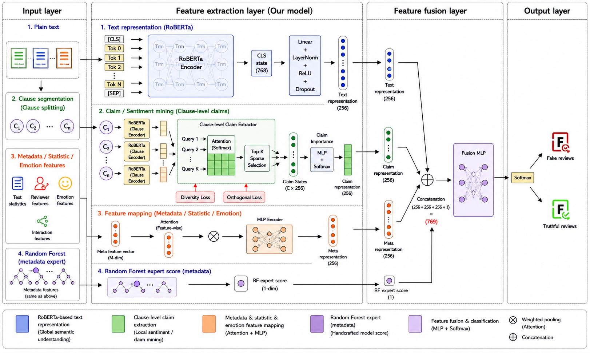

# CMAF-Net: Claim-aware Metadata Fusion for Chinese Fake Review Detection

[](https://www.python.org/)
[](https://pytorch.org/)
[](LICENSE)

CMAF-Net is a reproducible PyTorch implementation for Chinese fake restaurant review detection. The model combines:

- a Chinese RoBERTa global text encoder,
- a fine-grained clause-level claim extractor,
- an attention-based metadata branch,
- a Random Forest metadata expert score,
- and a fusion classifier for binary fake-review detection.

The code was developed for experiments on Dianping-style restaurant review data with text, labels, and review metadata.

## Overview

Fake reviews often hide deceptive signals in local expressions rather than in the whole review. A review may contain concrete dining details, mixed positive and negative experiences, templated promotional wording, exaggerated sentiment, or inconsistencies between ratings and textual evidence. CMAF-Net models these signals with a multi-branch architecture:

1. **Global text branch** encodes the whole review with `hfl/chinese-roberta-wwm-ext`.
2. **Claim branch** splits each review into clauses and uses learnable queries to extract fine-grained review units.
3. **Metadata branch** learns high-level representations from ratings, interaction counts, image indicators, time features, and text statistics.
4. **RF expert branch** provides an out-of-fold Random Forest score from metadata.
5. **Fusion classifier** combines global semantics, claim evidence, metadata representation, and expert score.



## Repository Structure

```text
CMAF-Net/
├── main_train.py              # Training, CV, threshold search, curves, ablations
├── requirements.txt           # Minimal Python dependencies
├── src/
│   ├── data_prep.py           # Data loading, clause splitting, metadata features
│   ├── dataset.py             # Dataset and collator
│   ├── experiment.py          # Single-fold, CV, strict-CV, and ablation routines
│   ├── meta_sampling.py       # NearMiss, scaling, RF OOF metadata expert
│   ├── model.py               # CMAF-Net model and claim losses
│   ├── training_utils.py      # Metrics, threshold search, seeds, early stopping
│   └── visualize.py           # Claim-level visualization helpers
├── data/
│   └── README.md              # Expected data schema; raw data is not committed
├── docs/
│   └── figures/               # Architecture figure for publication/reports
└── results/                   # Lightweight reproducibility results and curves
```

## Installation

Create an environment and install dependencies:

```bash
conda create -n cmaf python=3.10 -y
conda activate cmaf
pip install -r requirements.txt
```

The default backbone is downloaded from Hugging Face:

```text
hfl/chinese-roberta-wwm-ext
```

## Data Format

Place the training CSV at:

```text
data/merged_data.csv
```

The CSV must contain at least:

- `text`: review text,
- `label`: binary label, where `1` denotes fake review and `0` denotes truthful review.

Optional metadata columns are listed in [data/README.md](data/README.md). Missing metadata columns are filled with zeros by the loader, so the code can run with a reduced schema, but full metadata is recommended for reproducing the reported results.

Raw datasets are not included in this repository because platform review data may be subject to redistribution restrictions.

## Training

Run the paper-aligned 10-fold experiment:

```bash
python -u main_train.py \
  --csv_path data/merged_data.csv \
  --model_name hfl/chinese-roberta-wwm-ext \
  --n_splits 10 \
  --random_state 42 \
  --cuda_visible_devices 0 \
  --output_dir outputs
```

For a long server run:

```bash
nohup python -u main_train.py \
  --csv_path data/merged_data.csv \
  --model_name hfl/chinese-roberta-wwm-ext \
  --n_splits 10 \
  --random_state 42 \
  --cuda_visible_devices 0 \
  --output_dir outputs > train.log 2>&1 &
```

Outputs include:

- `outputs/cv_results.csv`
- `outputs/balanced_data.csv`
- `outputs/oof_roc.png`
- `outputs/oof_pr.png`

## Strict-CV Protocol

The default paper-aligned setting first applies global NearMiss balancing and then performs CV. A stricter protocol is also provided: each fold applies NearMiss only on the training split and keeps the validation split in its original distribution.

```bash
python -u main_train.py \
  --csv_path data/merged_data.csv \
  --model_name hfl/chinese-roberta-wwm-ext \
  --n_splits 10 \
  --random_state 42 \
  --cuda_visible_devices 0 \
  --output_dir outputs \
  --strict_cv
```

Strict-CV outputs are saved as:

- `outputs/strict_cv_results.csv`
- `outputs/strict_oof_roc.png`
- `outputs/strict_oof_pr.png`

## Ablation Study

Run the full model and the four core ablations:

```bash
python -u main_train.py \
  --csv_path data/merged_data.csv \
  --model_name hfl/chinese-roberta-wwm-ext \
  --n_splits 10 \
  --random_state 42 \
  --cuda_visible_devices 0 \
  --output_dir outputs \
  --run_ablation \
  --ablation_quick
```

Run ablations only:

```bash
python -u main_train.py \
  --csv_path data/merged_data.csv \
  --model_name hfl/chinese-roberta-wwm-ext \
  --n_splits 10 \
  --random_state 42 \
  --cuda_visible_devices 0 \
  --output_dir outputs \
  --ablation_only \
  --ablation_quick
```

The ablation table is saved to:

```text
outputs/ablation_results.csv
```

## Reproduced Results

The lightweight result files used for reporting are archived in [results/](results/).

### 10-fold CV

| Metric | Mean | Std |
|---|---:|---:|
| Accuracy | 0.9272 | 0.0097 |
| Precision | 0.9340 | 0.0159 |
| Recall | 0.9199 | 0.0222 |
| F1 | 0.9266 | 0.0102 |
| AUC | 0.9791 | 0.0050 |
| AP | 0.9796 | 0.0060 |

### Core Ablations

| Variant | Accuracy | Precision | Recall | F1 | AUC | AP |
|---|---:|---:|---:|---:|---:|---:|
| FULL | 0.9279 | 0.9333 | 0.9224 | 0.9275 | 0.9800 | 0.9808 |
| NO_RF | 0.9293 | 0.9354 | 0.9229 | 0.9289 | 0.9805 | 0.9816 |
| NO_CLAIM | 0.9295 | 0.9452 | 0.9125 | 0.9282 | 0.9814 | 0.9825 |
| NO_META | 0.8753 | 0.8835 | 0.8660 | 0.8742 | 0.9482 | 0.9495 |

## Citation

If you use this repository, please cite it with the metadata in [CITATION.cff](CITATION.cff). A BibTeX entry is also provided there.

## Notes on Reproducibility

- The code sets Python, NumPy, and PyTorch random seeds through `set_global_seed`.
- CUDA deterministic settings are enabled when available.
- Random Forest expert scores for training data are generated with out-of-fold predictions to reduce leakage.
- Large raw datasets, balanced intermediate data, checkpoints, and logs are intentionally excluded from version control.

## License

This project is released under the MIT License. See [LICENSE](LICENSE).
